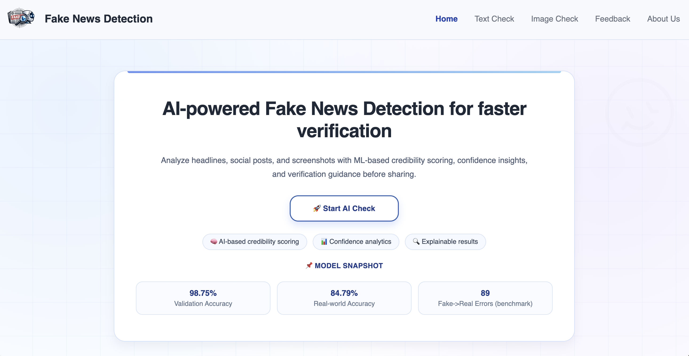
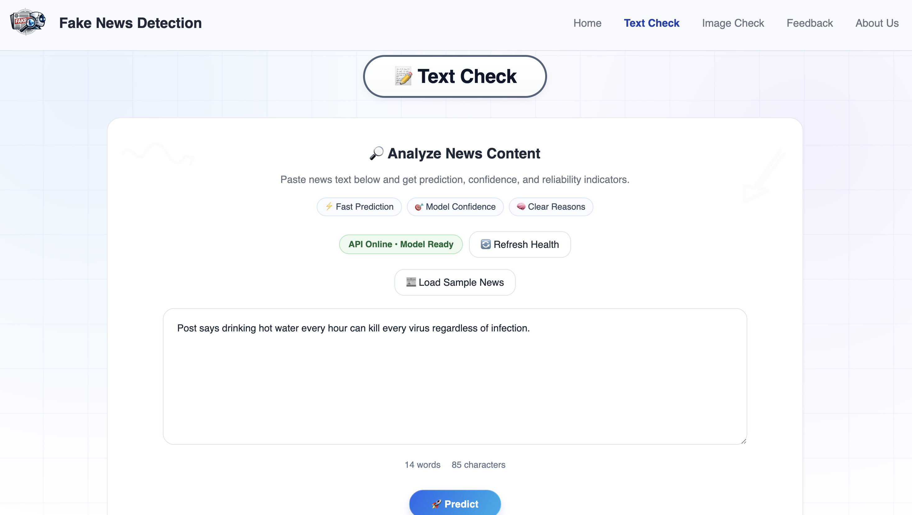
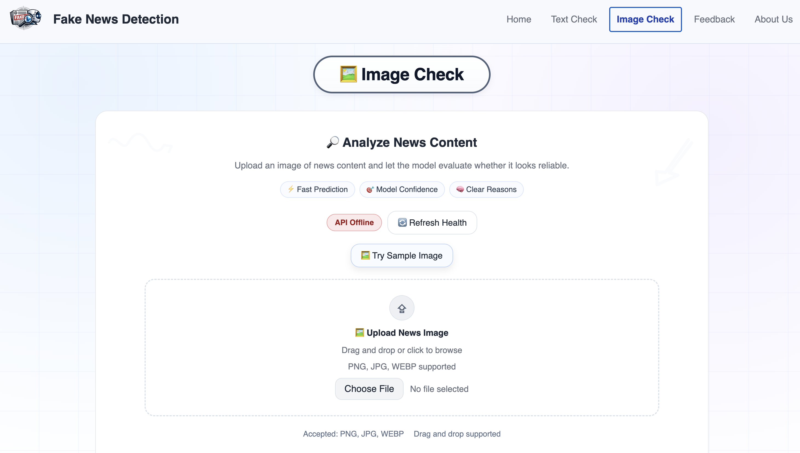
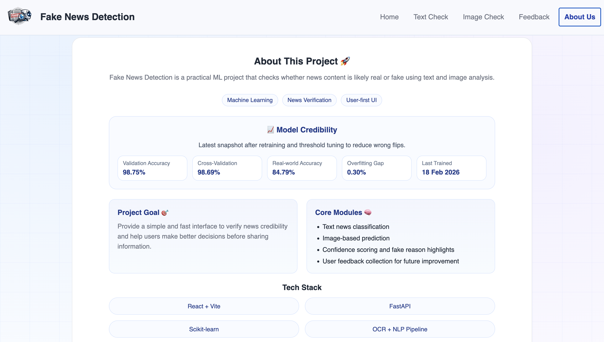
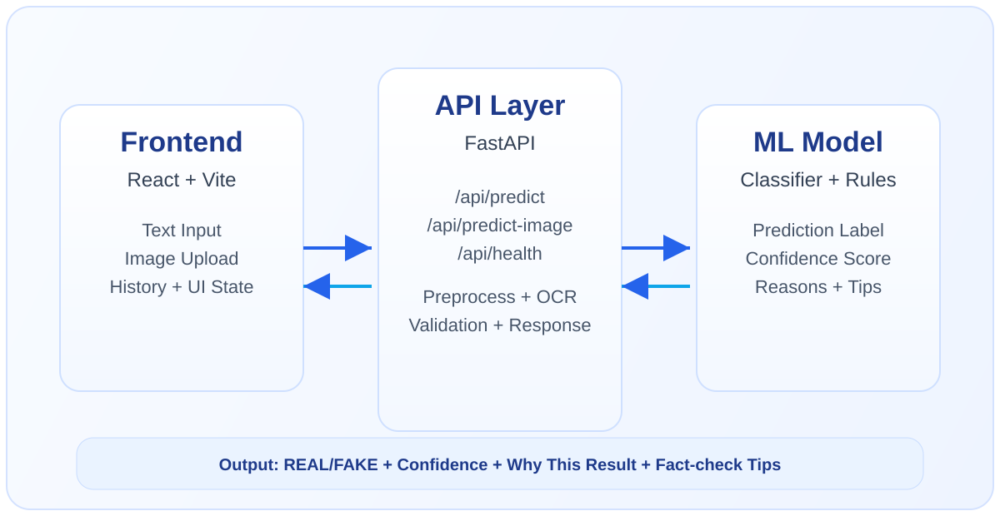

# Fake News Detection


A full-stack project to detect whether news content is likely **REAL** or **FAKE** using text classification and image OCR.

## Live Demo

- Website (GitHub Pages): `https://ankit-xo.github.io/FakeNewsDetection/home`

## Website Screenshots

| Home | Text Check |
|---|---|
|  |  |

| Image Check | About |
|---|---|
|  |  |


## Project Highlights

- Text news prediction with confidence score
- Image-based prediction using OCR + model inference
- Why-this-result explanation + fact-check tips
- API health indicator and retry UX
- Context-aware retry flow for both prediction and feedback failures
- Recent checks history (last 5 via localStorage)
- Feedback collection and contact email
- Mobile-optimized header/footer and responsive layout

## Model Performance Snapshot

| Metric | Value |
|---|---|
| Accuracy | 98.5% |
| Precision | 99.7% |
| Recall | 96.9% |
| F1 Score | 98.3% |
| Dataset Size | 38.8K+ records |
| Last Trained | 7 Apr 2026 |

Confusion matrix (validation split, positive class = FAKE):

| Actual \\ Predicted | FAKE | REAL |
|---|---:|---:|
| FAKE | 3470 | 110 |
| REAL | 9 | 4176 |

## Architecture

Frontend sends text/image input to FastAPI. Backend preprocesses text/OCR output, runs the model, and returns result + confidence + insights.



## Tech Stack

- Frontend: React + Vite
- Backend: FastAPI
- ML: scikit-learn
- OCR: pytesseract + Pillow

## Project Structure

```text
FakeNewsDetection/
├── backend/
│   ├── core/
│   │   ├── main.py              # FastAPI app + API routes
│   │   └── train.py             # ML training pipeline
│   ├── models/                  # trained model files
│   └── feedback/                # user feedback logs
├── dataset/                     # datasets (Git LFS)
├── frontend/
│   ├── public/assets/           # logo, favicon, architecture diagram
│   ├── src/
│   ├── package.json
│   └── vite.config.js
├── docs/
│   └── screenshots/             # README website screenshots
├── Dockerfile                   # Render backend container
├── render.yaml                  # Render Blueprint config
├── vercel.json                  # Vercel frontend build + SPA routing
├── Testing.md                   # QA checklist and test cases
├── requirements.txt
└── README.md
```

## Prerequisites

- Python 3.9+
- Node.js 18+
- npm
- Tesseract OCR installed only when using the server-side image endpoint

## Clone Repository

```bash
git clone https://github.com/ankit-xo/FakeNewsDetection.git
cd FakeNewsDetection
```

## Run Locally

### One Command Start

After installing Python dependencies and frontend packages once, start both backend and frontend together from the project root:

```bash
python3 run_dev.py
```

This starts:

- Frontend: `http://localhost:3000/home`
- Backend docs: `http://localhost:8000/docs`

If you already have a local `venv/`, the script will use it automatically.

### 1) Backend

macOS / Linux:

```bash
python3 -m venv venv
source venv/bin/activate
pip install -r requirements.txt
uvicorn backend.core.main:app --host 0.0.0.0 --port 8000 --reload
```

Windows PowerShell:

```powershell
python -m venv venv
venv\Scripts\activate
pip install -r requirements.txt
uvicorn backend.core.main:app --host 0.0.0.0 --port 8000 --reload
```

### 2) Frontend (new terminal)

```bash
cd frontend
npm install
npm run dev
```

### 3) Open App

- Frontend: `http://localhost:3000/home`
- Backend docs: `http://localhost:8000/docs`

### 4) Quick Health Check

- API health: `http://localhost:8000/api/health`
- Frontend health pill should show: `API Online • Model Ready`

## Quick Demo Flow (For Evaluator)

1. Open `Text Check` and click `Load Sample News`.
2. Click `Predict` and review:
   - result badge,
   - confidence bar,
   - `Why this result?`,
   - `Fact-check tips`.
3. Open `Image Check`, upload sample image, run prediction.
4. Test `Feedback` buttons (`Real` / `Fake`).
5. Disconnect backend briefly to verify error + retry UX.

## Environment Variable (Frontend)

The frontend uses same-origin `/api` by default, which is suitable for Vercel.
Set a backend base URL only when the frontend and backend are deployed
separately:

macOS / Linux:

```bash
cd frontend
VITE_API_BASE_URL=https://your-backend-url.com npm run deploy
```

Windows PowerShell:

```powershell
cd frontend
$env:VITE_API_BASE_URL="https://your-backend-url.com"
npm run deploy
```

## Deploy Frontend on GitHub Pages

```bash
cd frontend
npm install
npm run deploy
```

## Deploy Full Stack on Vercel

This repository deploys the Vite frontend on Vercel and uses the FastAPI backend
hosted on Render.

1. Import the repository into Vercel.
2. Keep the project root as the repository root.
3. Leave the build settings as configured by `vercel.json`.
4. Deploy and open `/home`.

No Vercel Python Function is required. Production API calls use the Render
backend URL configured in `frontend/src/App.jsx`. Image OCR runs in the browser,
then sends extracted text to the Render FastAPI model.

Set `VITE_API_BASE_URL` in Vercel only when deploying the backend at a different
public URL.

## Deploy Backend on Render (Docker)

This repository already includes `Dockerfile` and `render.yaml`.

1. Push latest code to GitHub.
2. In Render, create a new `Blueprint` or `Web Service`.
3. Use:
   - Runtime: Docker
   - Branch: `main`
   - Health Check Path: `/api/health`
4. Set env var:

```text
CORS_ALLOW_ORIGINS=https://ankit-xo.github.io,http://localhost:3000,http://127.0.0.1:3000
```

5. Deploy and verify:
   - `https://fake-news-detection-api-8zp1.onrender.com`

## API Endpoints

- `GET /api/health`
- `POST /api/predict`
- `POST /api/predict-image`
- `POST /api/feedback`


## Notes

- Threshold for REAL classification: `0.40` (loaded from model metadata)
- Dataset CSV files are tracked with Git LFS
- Render free plan may sleep after inactivity

## Author

**Ankit Anand**
- Feedback email: [ankitanand.works@gmail.com](mailto:ankitanand.works@gmail.com)
